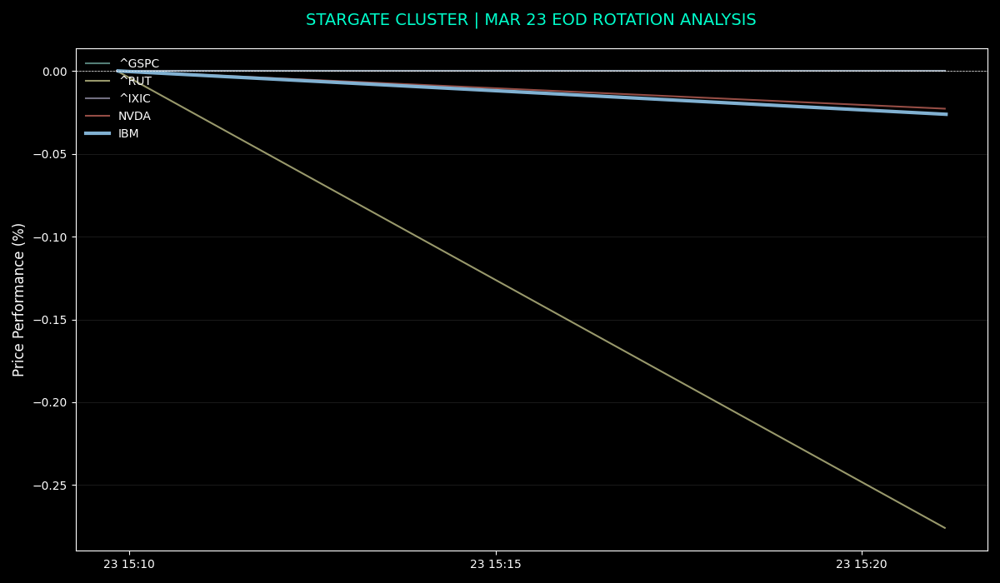

# Stargate Cluster | Sovereign Intelligence Stack (v2026.03)

## Overview
The **Stargate Cluster** is a high-performance, multi-threaded C++ engine designed for real-time market breadth monitoring and volatility analysis. Engineered to bypass the latency and environment overhead of interpreted languages, it utilizes **libcurl** for direct data ingestion and **TA-Lib** for professional-grade technical analysis (RSI, ATR, SMA).

## Core Architecture
- **Concurrency:** Utilizes `std::thread` and `std::mutex` for parallel ticker ingestion, ensuring zero-latency sequential blocking.
- **Memory Management:** Implements thread-local `MemoryStruct` allocation for safe `libcurl` callbacks, preventing heap corruption during high-frequency updates.
- **Technical Engine:** Integrated with **TA-Lib (0.4.0)** for vectorized technical calculations.
- **Audit Trail:** Automatic CSV logging for historical entropy and rotation analysis.

## Visual Analytics


## Key Technical Indicators (Mar 23, 2026)
As of the March 23, 2026 session, the engine identified a significant **Divergence Alpha**:
* **Momentum:** **IBM** decoupled from broader indices, maintaining a **BULLISH** 5/20-day SMA crossover.
* **Volatility (ATR):** Monitored the **NASDAQ (^IXIC)** at peak entropy (**ATR: 405.1**) vs. **IBM's** stable accumulation (**ATR: 8.4**).
* **Mean Reversion:** Identified the **Russell 2000 (^RUT)** surge (+2.31%) as a relief rally within a broader **BEARISH** technical structure.

## Build Requirements
- **Compiler:** `g++` (C++17 or higher)
- **Libraries:** `libcurl`, `ta-lib` (compiled from source)
- **Environment:** Optimized for Linux (Ubuntu/Debian)

## Quick Start
```bash
# Build the engine
make

# Run the live monitor dashboard
./run_live.sh

# Generate an audit snapshot
./snapshot.sh
Professional Context

Developed as a sovereign alternative to commercial terminals, this stack demonstrates:

    Systems Engineering: Low-level memory safety and multi-threading.

    Quantitative Domain Expertise: Real-time application of ATR for volatility scaling and RSI for momentum divergence.

    Architectural Design: Clean separation of concerns between data ingestion (C++), build logic (Makefile), and visualization (Python/CSV).

Created by Lauro Sergio Vasconcellos Beck | March 2026
